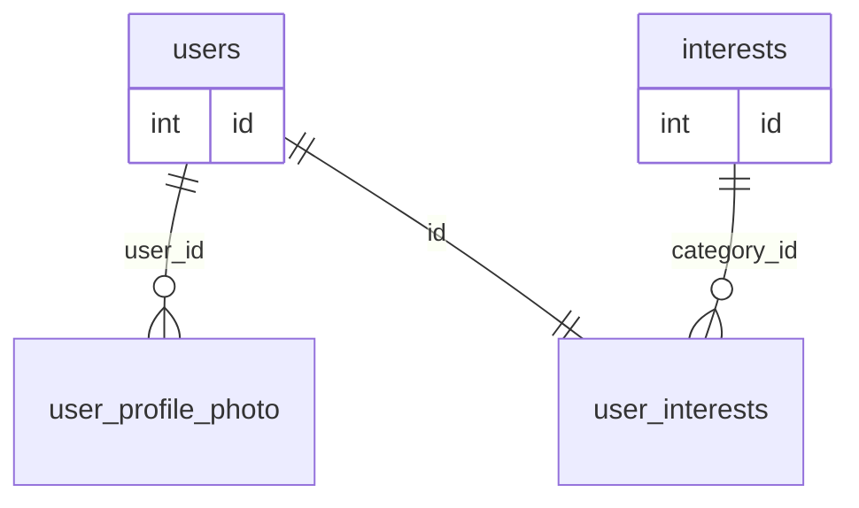
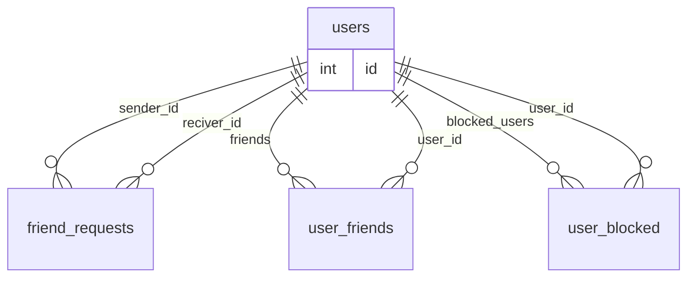
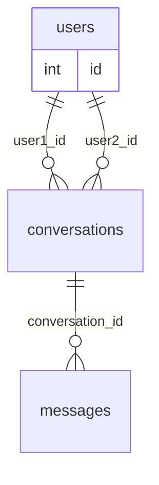
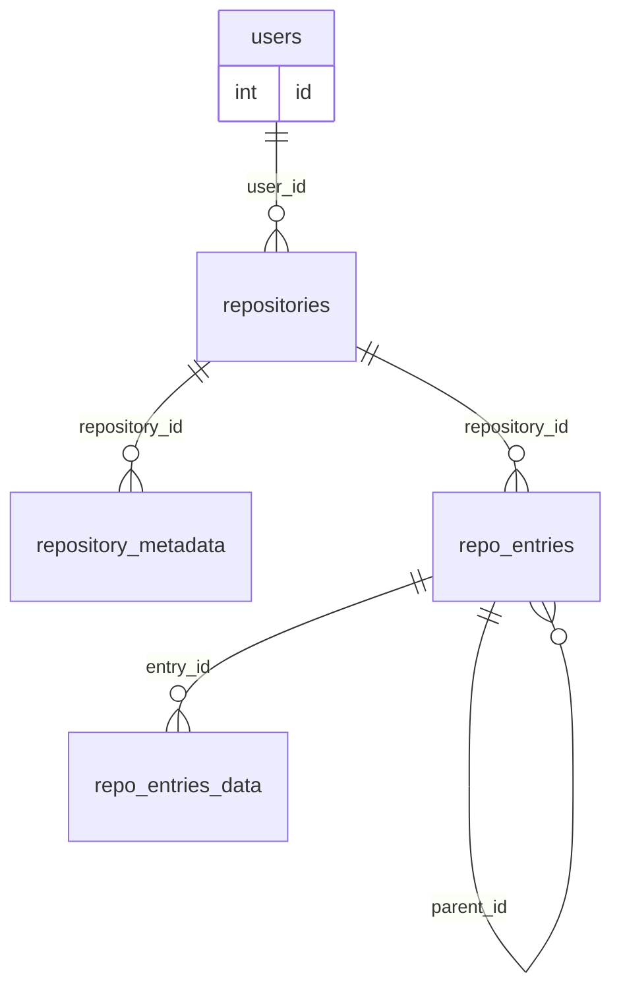

# 📚 Dokumentacja bazy danych

> Format: **PostgreSQL 15+**  
> Konwencja nazw: _snake_case_, angielski.  
> Diagram ER poniżej w Mermaid – można wkleić do https://mermaid.live aby zobaczyć grafikę.

---

## 1. USERS
grupa tabel skupiona tylko i wylacznie na uzytkowniku i jego najwazniejszych danych osobistych 
### 1.1 users

| Kolumna | Typ | Opis |
|---|---|---|
| `id` | int | Klucz podstawowy |
| `email` | citext | - (UNIQUE, NOT NULL) |
| `password_hash` | text | - NOT NULL |
| `first_name` | text | - NOT NULL |
| `last_name` | text | - NOT NULL |
| `nick` | text | - UNIQUE, NOT NULL |
| `bio` | text | -  |
| `age` | integer |-  CHECK (age >=8 ) |
| `is_active` | boolean |-  DEFAULT false |
| `created_at` | timestamptz |-  NOT NULL, DEFAULT now() |

**Opis tabeli**: Tabela przechowująca podstawowe informacje o użytkownikach aplikacji, 
**służy jako główna tabela referencyjna dla większości relacji.**

### 1.2 user_profile_photo

| Kolumna | Typ | Opis |
|---|---|---|
| id | serial | Klucz podstawowy |
| user_id | serial | klucz obcy do  → users(id) |
| file_name | text | - NOT NULL |
| file_data | bytea | blob pliku zdjeciaNOT NULL |
| type | text |-  CHECK (mime_type IN ('image/jpeg', 'image/jpg', 'image/png', 'image/webp')) |
| uploaded_at | timestamptz |-  DEFAULT now() |

**Opis tabeli**: Przechowuje metadane i binarne dane zdjęcia profilowego przypisanego do użytkownika.

## 2. Zainteresowania

### 2.1 intrests

| Kolumna | Typ | Opis |
|---|---|---|
| id | serial | Klucz podstawowy |
| name | text | nazwa zaintersowania UNIQUE, NOT NULL |
| description | text | opis zainteresownia  |

**Opis tabeli**: Słownikowe zestawienie wszystkich możliwych zainteresowań dostępnych w systemie.

### 2.2 user_interests

| Kolumna | Typ | Opis |
|---|---|---|
| user_id | serial | klucz podstawowy i obcy do → users(id) |
| intrest_id | wektor | wektor id zainteresowan polubionych przez uzytkownika → intrests(id) |

**Opis tabeli**: Tabela łącznikowa  między użytkownikiem a jego zainteresowaniami.

## 3. Relacje użytkowników

### 3.1 friend_requests

| Kolumna | Typ | Opis |
|---|---|---|
| id | serial | Klucz podstawowy |
| sender_id | serial | klucz obcy do → users(id) |
| receiver_id | serial | klucz obcy do → users(id) |
| status | text | - CHECK (status IN ('pending','accepted','rejected')) DEFAULT 'pending' |
| requested_at | timestamptz | - DEFAULT now() |

**Opis tabeli**: Rejestr wysłanych zaproszeń do grona przyjaciol między użytkownikami wraz ze statusem i datami.

### 3.2 user_friends

| Kolumna | Typ | Opis |
|---|---|---|
| user_id | serial | klucz podstawowy do → users(id) |
| friends | wektor | wektor z id użytkowników z którymi przyjażni się User klucz obcy do → users(id) |

**Opis tabeli**: Pozwala na wyprowadzenie listy przyjaciół użytkownika w prosty i przyjazny sposób

### 3.3 user_blocked

| Kolumna | Typ | Opis |
|---|---|---|
| user_id | serial | klucz obcy podstawowy do → users(id) |
| blocked_users | wektor | wektor z id użytkowników z którymi przyjażni się User klucz obcy do → users(id) |

**Opis tabeli**: Przechowuje informacje o zablokowanych użytkownikach przez użytkownika podstawowego

## 4. Komunikacja

### 4.1 conversations

| Kolumna | Typ | Opis |
|---|---|---|
| id | bigserial | klucz podstawowy |
| user1_id | serial | klucz obcy do → users(id) |
| user2_id | serial | klucz obcy do → users(id) |
| created_at | timestamptz | - NOT NULL, DEFAULT now() |

**Złożone ograniczenia / klucze tabelaryczne**:
- `CHECK (user1_id < user2_id)`
- `UNIQUE (user1_id, user2_id)`

**Opis tabeli**: Reprezentuje unikalne konwersacje 1‑na‑1 pomiędzy dwoma użytkownikami.

### 4.2 messages

| Kolumna | Typ | Opis |
|---|---|---|
| id | bigserial | klucz podstawowy |
| conversation_id | bigserial | klucz obcy do → conversations(id) |
| sender_id | serial | klucz obcy do → users(id) |
| receiver_id | serial | klucz obcy do → users(id) |
| message_type | text | - CHECK (message_type IN ('text','image/JPEG','image/PNG','image/WEBP','link','voice','file/TXT','folder','ZIP')) NOT NULL |
| content | bytea |-  NOT NULL |
| sent_at | timestamptz | - DEFAULT now() |
| is_read | boolean |-  DEFAULT false |

**Opis tabeli**: Przechowuje wszystkie wiadomości należące do konwersacji, wraz z metadanymi i treścią.

## 5. Pozostałe tabele

### 5.1 repositories

| Kolumna | Typ | Opis |
|---|---|---|
| id | serial | klucz podstawowy |
| user_id | serial | klucz obcy do → users(id) |
| name | text | - NOT NULL |
| description | text |-   |

**Złożone ograniczenia / klucze tabelaryczne**:
- `UNIQUE(user_id, name)`

**Opis tabeli**: Główna tabela repozytoriów kodu tworzonych przez użytkowników.

### 5.2 repository_metadata

| Kolumna | Typ | Opis |
|---|---|---|
| repository_id | serial | klucz podstawowy, klucz obcy do → repositories(id) |
| total_files | integer |-  DEFAULT 0 |
| total_folders | integer |-  DEFAULT 0 |
| total_size | bigint |-  DEFAULT 0 (bajty) |
| created_at | timestamptz |-  DEFAULT now() |
| last_modified | timestamptz |-   |
| license | text |-   |
| visibility | text |-  CHECK (visibility IN ('public','private')) DEFAULT 'private' |

**Opis tabeli**: Zbiorcze statystyki i informacje pojedynczego repozytorium.

### 5.3 repo_entries

| Kolumna | Typ | Opis |
|---|---|---|
| id | serial | klucz podstawowy |
| name | text | - NOT NULL |
| repository_id | uuid |-  klucz obcy do → repositories(id) |
| parent_id | uuid | klucz obcy do → repo_entries(id) │ NULL jeśli element w katalogu głównym |

**Opis tabeli**: Hierarchiczne wpisy repozytorium (pliki oraz katalogi).

### 5.4 repo_entries_data

| Kolumna | Typ | Opis |
|---|---|---|
| entry_id | serial | klucz podstawowy, klucz obcy do → repo_entries(id) |
| is_directory | boolean | NOT NULL, DEFAULT false |
| extension | text | - CHECK (extension IN ('txt','py','java','cpp','js','html','css','json','xml')) |
| content | text | tu znajduję się zawartośc pliku czyli   |
| number_of_lines | integer | -  |
| size | integer | -  |
| last_modified | timestamptz | - DEFAULT now() |
| created_at | timestamptz |-  DEFAULT now() |

**Złożone ograniczenia / klucze tabelaryczne**:
- `CHECK ((is_directory = true AND extension IS NULL AND content IS NULL AND number_of_lines IS NULL) OR (is_directory = false))`
- `CHECK (size >= 0)`

**Opis tabeli**: Dodatkowe dane każdego wpisu repozytorium, w tym treść plików oraz metadane techniczne.

---

## 5. Moduł antyplagiatowy (TODO)

TODO w całości do zrobienia

---

## 6. Data Base diagrams visualisation
### 6.1 User primary information

---
### 6.2 Frendship relations 

---
### 6.3 Conversations

---
### 6.4 Repositories and files

---
